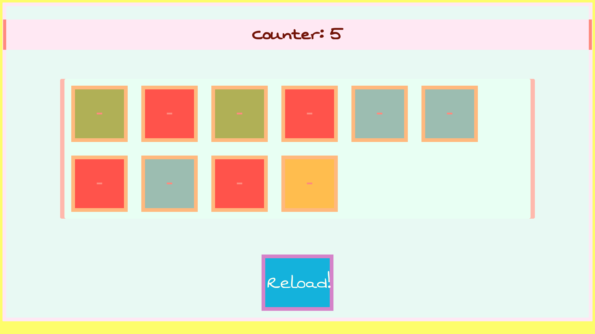

# box-picker

### What is this?

Simple JS browser game, wrote as a side effect of one of the lazy Sundays. Wanna play? Go for it &amp; have fun!

### How it has been written?

Simple & pure <strong>javascript</strong> for logic, <strong>css</strong> for styling. I also nicked one font from Google Fonts & it's being rendered via CDN.

### Issues

There are probably several things to refactor (especially inside of script.js file), however it will stay as it is, since it's just a funny project. Also, more colours need to be added (actually, this is simple fix).

### Screenshots
 

